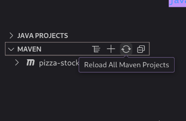
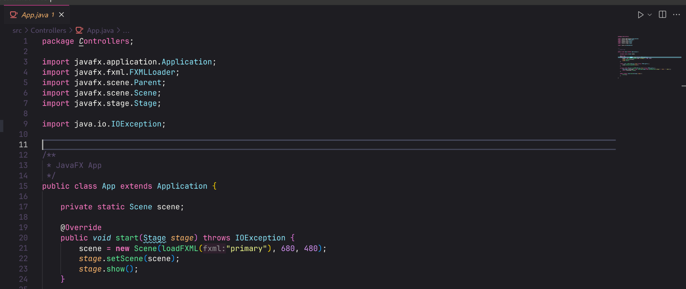

# Baixando o projeto localmente

1 - Quando baixar o projeto, configure o `classpath` para __src__

- Após isso, reinicie Maven através da extensão:

- Depois, vá até o arquivo `src/Controllers/App.java`, basta iniciar clicando no botão de play da IDE:

