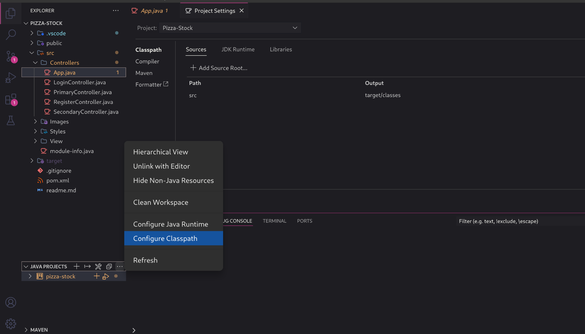
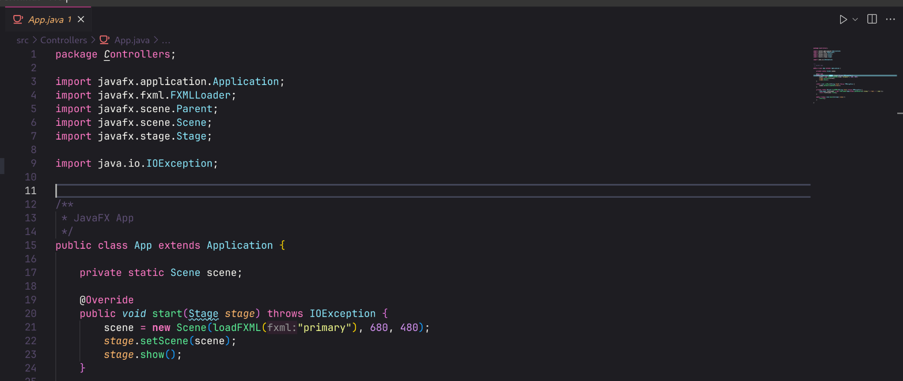

# Baixando o projeto localmente

- Quando baixar o projeto, reinicie Maven através da extensão:

- Depois, vá até o arquivo `src/Controllers/App.java`, basta iniciar clicando no botão de play da IDE:

