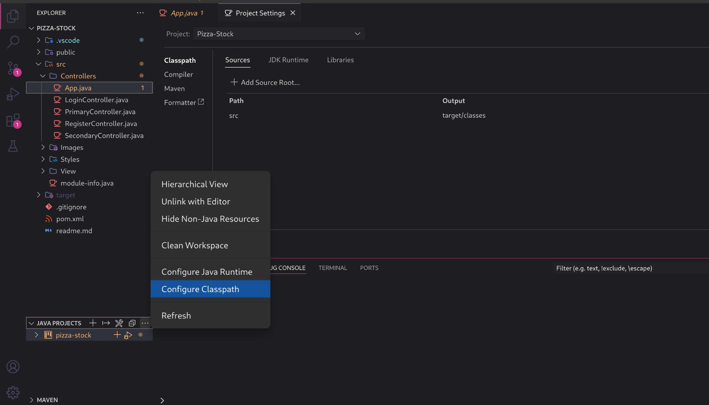
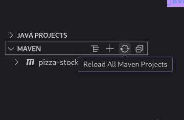
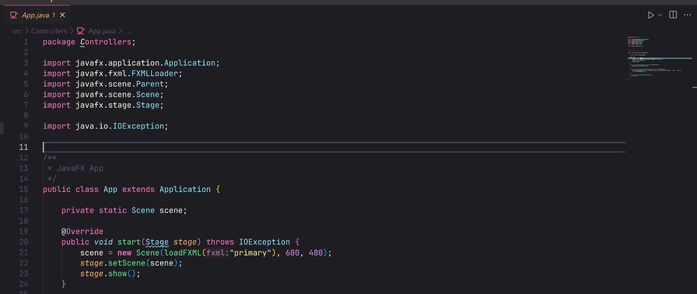
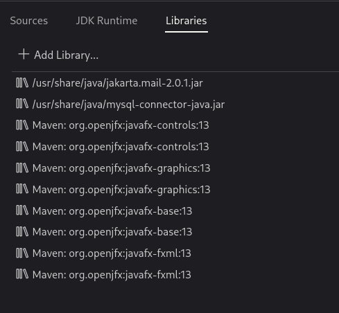
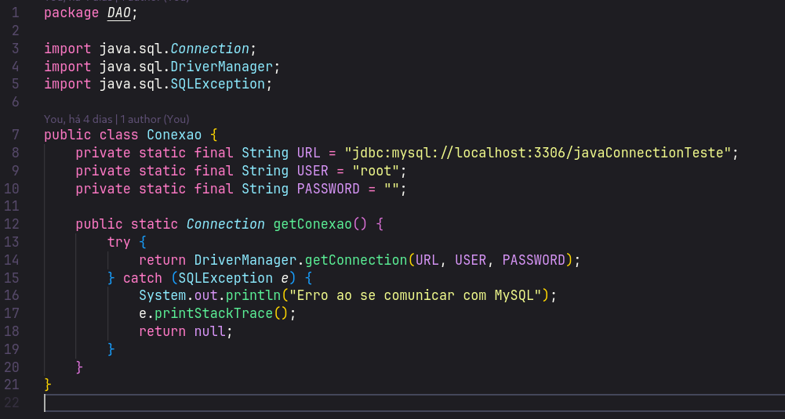

# ⚠️ -  Aqui está o projeto final

1 - Quando baixar o projeto, configure o `classpath` para __src__

2 - Após isso, reinicie Maven através da extensão:

3 - Depois, vá até o arquivo `src/Controllers/App.java`, basta iniciar clicando no botão de play da IDE:

4 - Tuturial de como baixo o driver do `JDBC` e rodar no vscode - Linux <a href="https://pt.stackoverflow.com/questions/88922/como-corrigir-o-erro-sqlexception-no-suitable-driver-found-ao-realizar-uma-co" >aqui</a>:

Tem que ficar assim(o driver): 

5 - Acesse o arquivo que contém o schema do banco de dados `src/Resources/schema.sql`, copie o código.

6 - Vá no _MySQLWorkBench_ , cole o código e rode.

7 - Caso a conexão não tenha sido estabelecida, verifique o seu usuário e senha no arquivo de conexão `src/DAO/Conexao.java`:

